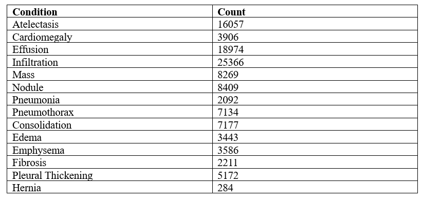
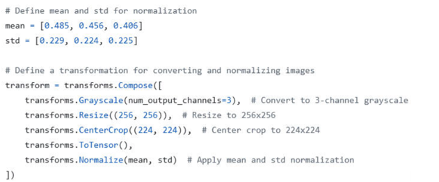
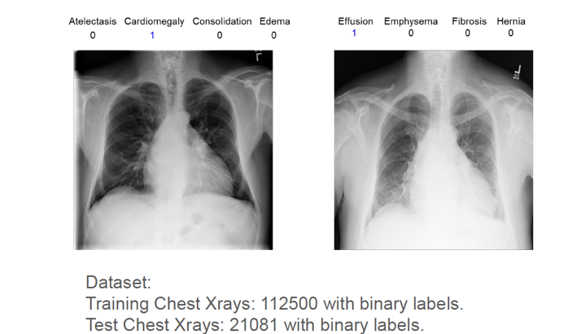
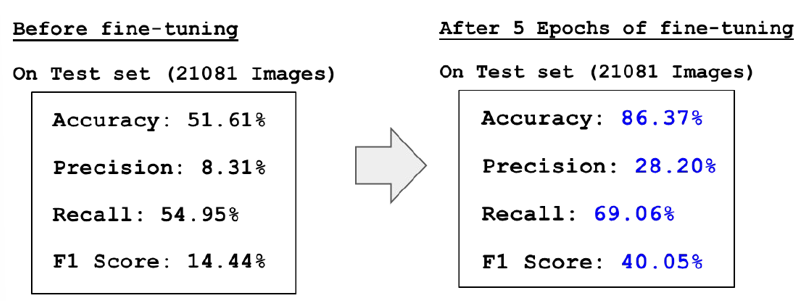
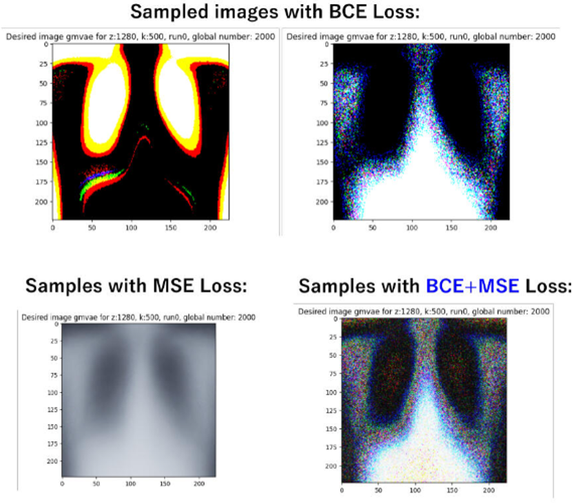

# Multi-Pathology Chest X-ray Classification and Generation using Gaussian Mixture VAE Model.
This custom final project is part of the CS236 Graduate Course in Generative AI, Post-Graduate Certificate in AI from Stanford University. 

**-- Prohect Status Completed**
*Readme.md update: 2025-08-25*

To run this project on your local machine:

1. Clone the repository:
   ```bash
   git clone https://github.com/juanpajedrez/CS236-Final-Proj.git```
2. Run with Jupyter: https://jupyter.org/install 

### Contributors
- Kuniaki Iwanami
- Juan Pablo Triana Martinez

## Project Intro/Objective
The main objective of this custom final project is to perform the following:
- Develop a generative classifier capable of detecting medical pathologies (such as effusion, pneumonia, pneumothorax) based on chest X-ray images.
- Create a generative model using VAE architecture to produce high-quality synthetic chest X-ray images using a simple z-space (Gaussian mixture).

## Technologies
- Python
- Jupyter Notebook

## Dataset
- **Source**: https://nihcc.app.box.com/v/ChestXray-NIHCC/file/220660789610
- **Variables**: Aside from the multi-discrete label from the following 14 different conditions: (Atelactasis, Cardiomelagy, Effusion, Infiltration, Mass , Nodule, Pneumonia, Pneumothorax, Consolidation, Edema, Emphysema, Fibrosis, Pleural Thickening, Hernia).
- **Size**: The dataset comprises 112,120 X-ray frontal view images from 30,850 unique patients. Each of these images has a resolution of 1024 x 1024. They are labeled with 14 different labels representing the binary label presence of one of the 15 different classes, 14 representing the chest X-rays conditions, and one referring to no findings.
- **No Findings**: Interestingly, there is a much higher number of downloadable images than 112,120 Chest X-ray images, where they contain No findings as the label. These are important to add to give the model the ability to determine when a frontal chest X-ray doesn’t contain any medical conditions.



## Project Steps:
1. **Downloading Data**: Using `utils/fig_downloader.py` customed class, the data was downloaded from NIH page.
2. **Data Cleaning Preparation**: A customized `torch.utils.data.Dataset` and `torch.utils.data.Dataloader` was used, alongside the following `torchvision.transform`, in order to retrieve proper data PyTorch tensor format.



3. **GMVAE Model**: Stored in `src/utils/models/gmvae.py`, and using `src/utils.models/nns/GMVAE_CXR14_V3.py`, the model architecture is set to be trained with `train.py`.
4. **FSGMVAE Model**:Stored in `src/utils/models/fs_gmvae.py`, and using `src/utils.models/nns/FSVAE_CXR14_V3.py`, the model architecture is set to be trained with `train.py`.

## Multi Classification Results:





**Recommendations**
These are the main recommendations we identified for future analyses on multiclass classification using this open dataset:

1.	**Progressive complexity with conditions**
This project began directly with all 14 chest X-ray conditions. A valuable direction would be to examine how generative models perform as the number of conditions increases incrementally. For example, starting with only 2 conditions, then expanding to 4, 6, 8, and so forth, would provide insights into scalability and model robustness.

2.	**Addressing class imbalance**:
The dataset was not balanced before fine-tuning, which can lead to severe model bias in interpreting the data. While real-world distributions may indeed reflect a higher prevalence of certain conditions (e.g., cardiomegaly vs. effusion), exploring strategies to balance precision and generalization remains a critical area for future research.

## Generative Images Results:



**Recommendations**
These are the main recommendations we identified for future analyses on multiclass generative Chest X-ray data.

1.	**Convolutional Decoders**: In this project, we used a high-dimensional linear layer decoder to recreate generative images. The problem with that approach is that the spatial-structure localized information is lost when the input is flattened and passed through a network. Also, there is a much higher number of computations; therefore, for future analysis, it’s imperative to use convolutional decoders instead.

2.	**Progressive Complexity with Conditions**: Same as the Multi-classification setting, a valuable direction would be to see how the generative model of the FS-GMVAE behaves as the number of conditions increases.

3.	**Z-space representation**. Currently, a linear layer is used as the z-space representation to sample from the K-gaussian desired representation. This can also lead to spatial information being lost completely. It’s recommended to find a convolutional 2D z-space, with an optimized sampling approach (like an autoencoder), where data can be compressed enough; while also retaining the probabilistic variability of variational autoencoders to create rich generative AI Chest-X-rays images.

Thank you for your time and visiting this project!